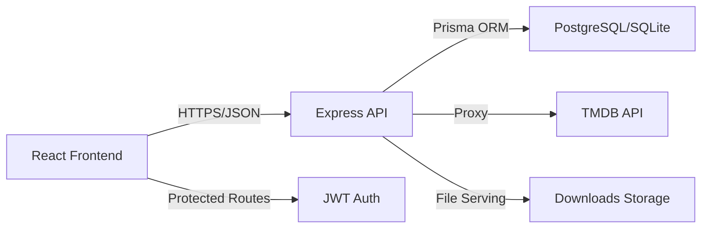

<div align="center">

# 🎬 StreamVault

### The Ultimate Personal Streaming Hub

A modern, full-stack media platform combining Netflix-inspired UX with production-grade engineering. Built to showcase real-world development skills in React, TypeScript, and backend architecture.

[**🌐 Live Demo**](https://stream-vault-7u6q.vercel.app/) · [**📖 Documentation**](#-getting-started) · [**🐞 Report Bug**](https://github.com/burhanuddin/streamvault/issues) · [**✨ Request Feature**](https://github.com/burhanuddin/streamvault/issues)


[](https://reactjs.org/)
[](https://www.typescriptlang.org/)
[](https://vitejs.dev/)
[](https://tailwindcss.com/)
[](https://www.prisma.io/)
[](https://bun.sh/)

</div>

---

## 🌟 Overview

**StreamVault** is a production-ready streaming platform that demonstrates mastery of modern web development practices. Featuring a sleek, glass-morphic interface and robust backend architecture, it delivers a premium viewing experience while maintaining clean, scalable code.

### Why StreamVault?

- **Performance First**: Vite-powered frontend with optimized bundle sizes and lazy loading
- **Type-Safe**: End-to-end TypeScript for reduced runtime errors
- **Database-Driven**: Prisma ORM with relational data modeling
- **Secure by Design**: JWT authentication, API key protection, and secure routing
- **Production-Ready**: Health checks, error handling, and deployment-optimized

---

## ✨ Features

### 🎨 **Frontend Experience**
- **Modern UI/UX**: Glass-morphic design with Tailwind CSS and shadcn/ui components
- **Fully Responsive**: Seamless experience across mobile, tablet, and desktop
- **Hero Carousel**: Auto-playing showcase of featured content
- **Infinite Scroll**: Dynamic loading for large media libraries
- **Smooth Animations**: Framer Motion-powered transitions and skeleton loaders

### 🔐 **User Features**
- **Secure Authentication**: JWT-based login and signup system
- **Favorites & Watchlist**: Personalized collection management
- **Continue Watching**: Smart resume with progress tracking across sessions
- **Auto-Resume**: Pick up exactly where you left off for movies and TV episodes
- **Profile Management**: Custom avatars and account settings

### 📥 **Downloads System**
- **Backend-Managed**: Secure file handling and serving
- **Rich Metadata**: TMDB integration for posters and descriptions
- **Smart Search**: Filter and find downloaded content instantly
- **Direct Access**: One-click downloads from organized media cards

### 🧠 **Backend Architecture**
- **Prisma ORM**: Type-safe database queries with migration support
- **RESTful API**: Clean endpoint design with proper HTTP methods
- **JWT Authentication**: Protected routes and user session management
- **TMDB Proxy**: Frontend never exposes third-party API keys
- **Cold-Start Optimization**: Health check endpoints for serverless deployments

---

## 🏗️ Architecture



**Security Model**: All API keys and secrets remain server-side. The frontend communicates solely through authenticated backend endpoints.

---

## 🛠️ Tech Stack

<table>
<tr>
<td valign="top" width="50%">

### Frontend
- **Framework**: React 18 + TypeScript
- **Build Tool**: Vite
- **Styling**: TailwindCSS, shadcn/ui
- **State Management**: React Context API
- **Routing**: React Router v6
- **HTTP Client**: Axios
- **Icons**: Lucide React

</td>
<td valign="top" width="50%">

### Backend
- **Runtime**: Bun (Node.js compatible)
- **Framework**: Express
- **ORM**: Prisma
- **Database**: PostgreSQL (prod), SQLite (dev)
- **Authentication**: JWT
- **API Integration**: TMDB API v3
- **File Storage**: Local filesystem

</td>
</tr>
</table>

---

## 📂 Project Structure

```
StreamVault/
├── src/                      # Frontend application
│   ├── components/           # Reusable UI components
│   │   ├── ui/              # shadcn/ui base components
│   │   ├── MediaCard.tsx    # Media display card
│   │   ├── HeroCarousel.tsx # Featured content slider
│   │   └── Navbar.tsx       # Navigation bar
│   ├── pages/               # Route pages
│   │   ├── Home.tsx         # Landing page
│   │   ├── Watch.tsx        # Video player page
│   │   ├── Favorites.tsx    # User's saved content
│   │   └── Downloads.tsx    # Downloaded media
│   ├── hooks/               # Custom React hooks
│   ├── auth/                # Authentication logic & guards
│   ├── lib/                 # Utilities & API client
│   └── types/               # TypeScript definitions
│
├── backend/                  # Backend application
│   ├── prisma/              # Database schema & migrations
│   │   ├── schema.prisma    # Data models
│   │   └── migrations/      # Version-controlled DB changes
│   ├── routes/              # API endpoints
│   │   ├── auth.ts          # Authentication routes
│   │   ├── media.ts         # Media CRUD operations
│   │   └── downloads.ts     # Download management
│   ├── middleware/          # Express middleware
│   │   └── auth.ts          # JWT verification
│   ├── public/              # Static file serving
│   │   └── downloads/       # Downloaded media files
│   └── server.ts            # Application entry point
│
├── public/                   # Frontend static assets
└── README.md                # You are here!
```

---

## 🚀 Getting Started

### Prerequisites

- **Bun** v1.0+ (or Node.js v18+)
- **Git**
- **TMDB API Key** ([Get one here](https://www.themoviedb.org/settings/api))

### Installation

#### 1️⃣ Clone the Repository

```bash
git clone https://github.com/burhanuddin/streamvault.git
cd streamvault
```

#### 2️⃣ Install Dependencies

**Frontend:**
```bash
bun install
```

**Backend:**
```bash
cd backend
bun install
cd ..
```


#### 4️⃣ Database Setup

```bash
cd backend
bun x prisma migrate dev --name init
bun x prisma generate
cd ..
```

#### 5️⃣ Start Development Servers

**Option 1 - Single Command (Recommended):**
```bash
npm start
# This runs both frontend and backend concurrently
```

**Option 2 - Separate Terminals:**

**Terminal 1 - Frontend:**
```bash
npm run dev:frontend
```

**Terminal 2 - Backend:**
```bash
npm run dev:backend
```

**Access the application:**
- Frontend: http://localhost:5173
- Backend API: http://localhost:3000

---

## 📸 Screenshots

<div align="center">

### Home Page with Hero Carousel


### Continue Watching & Favorites


### Downloads Library


### Video Player


</div>

---

## 🎯 Key Features Deep Dive

### Smart Resume System
StreamVault uses intelligent progress tracking to determine when to resume content:
- **Movies**: Resumes between 10% and 90% progress
- **TV Shows**: Episode-level tracking with season context
- **Auto-hide**: Completed content (>90%) automatically removed from Continue Watching

### TMDB Integration
All metadata is enriched through The Movie Database:
- Real-time poster and backdrop images
- Cast and crew information
- Ratings and release dates
- Genre classification
- Episode guides for TV series

### Download Management
Backend-controlled file serving with rich metadata:
- Secure file storage outside web root
- Metadata enrichment for local files
- Search and filter capabilities
- Organized by type (movies/shows)

---

## 🔧 Available Scripts

### Frontend
```bash
bun run dev          # Start development server
bun run build        # Production build
bun run preview      # Preview production build
bun run lint         # Run ESLint
```

### Backend
```bash
bun run dev          # Start with hot-reload
bun run start        # Production start
bun run migrate      # Run database migrations
bun run studio       # Open Prisma Studio
```

---

## 🌐 Deployment

### Frontend (Vercel)
```bash
# Already configured with vercel.json
vercel --prod
```

### Backend (Railway/Render)
1. Set environment variables in platform dashboard
2. Change `DATABASE_URL` to PostgreSQL connection string
3. Run migrations: `bunx prisma migrate deploy`
4. Deploy from GitHub integration


## 🗺️ Roadmap

- [ ] **Redis Caching**: Cache TMDB responses to reduce API calls
- [ ] **User Profiles**: Multi-profile support per account
- [ ] **Watch History**: Timeline view of viewing activity
- [ ] **Recommendations**: AI-powered content suggestions
- [ ] **Multi-Provider**: Fallback player sources
- [ ] **Admin Panel**: Content management dashboard
- [ ] **Subtitles**: Multi-language subtitle support
- [ ] **Social Features**: Share favorites and reviews

---

## 🤝 Contributing

Contributions make the open-source community amazing! Any contributions you make are **greatly appreciated**.

1. Fork the Project
2. Create your Feature Branch (`git checkout -b feature/AmazingFeature`)
3. Commit your Changes (`git commit -m 'Add some AmazingFeature'`)
4. Push to the Branch (`git push origin feature/AmazingFeature`)
5. Open a Pull Request

### Development Guidelines
- Follow existing code style and conventions
- Write meaningful commit messages
- Add tests for new features
- Update documentation as needed

---

## 📜 Legal Disclaimer

**StreamVault is an educational portfolio project.**

- ⚠️ **No Content Hosting**: This application does not host any video files
- 🔗 **Metadata Only**: All data is sourced from TMDB API under their terms of service
- 🎥 **Embedded Players**: Video streams are embedded from third-party providers
- 📝 **No Copyright Infringement**: No copyrighted content is stored on this server

**Use Responsibly**: Ensure you have proper rights to access any content you stream through this platform.

---

## 📄 License

Distributed under the MIT License. See `LICENSE` file for more information.

---

## 👤 Author

**Burhanuddin Rajkotwala**

- GitHub: [@burhanuddin](https://github.com/burhanuddin)
- Portfolio: *Coming Soon* 🚀
- LinkedIn: [Connect with me](https://linkedin.com/in/burhanuddin-rajkotwala)

---

## 🙏 Acknowledgments

- [TMDB](https://www.themoviedb.org/) for providing comprehensive media metadata
- [shadcn/ui](https://ui.shadcn.com/) for beautiful, accessible components
- [Lucide](https://lucide.dev/) for the icon system
- [Prisma](https://www.prisma.io/) for the excellent ORM experience

---

<div align="center">

**Built with ❤️ using React · TypeScript · Bun · Prisma**

If you found this project helpful, please consider giving it a ⭐!

[⬆ Back to Top](#-streamvault)

</div>
